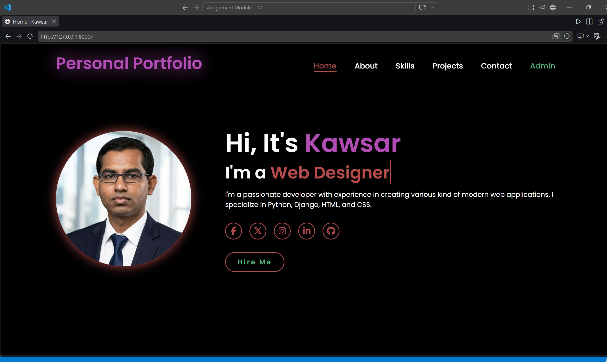
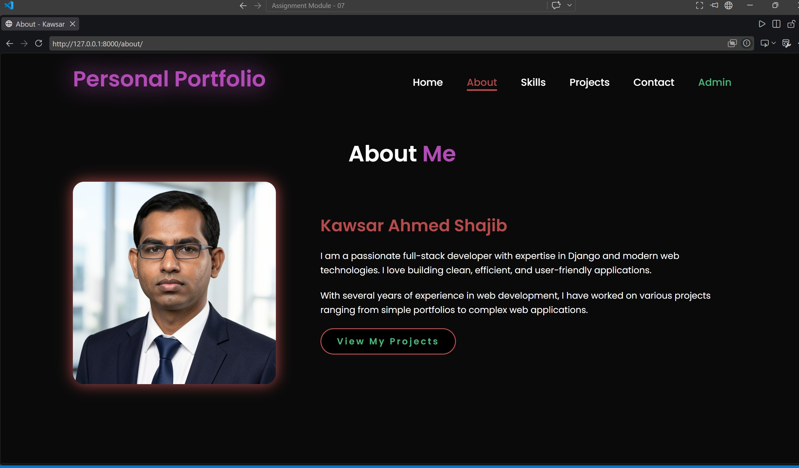
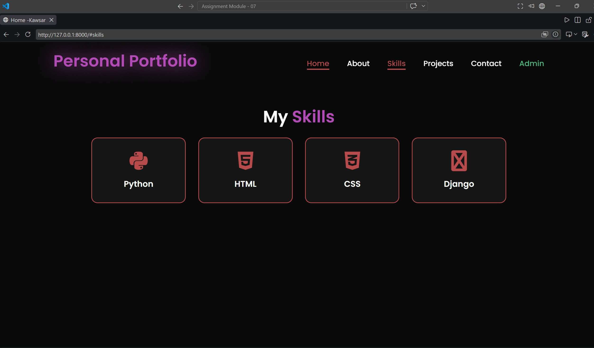
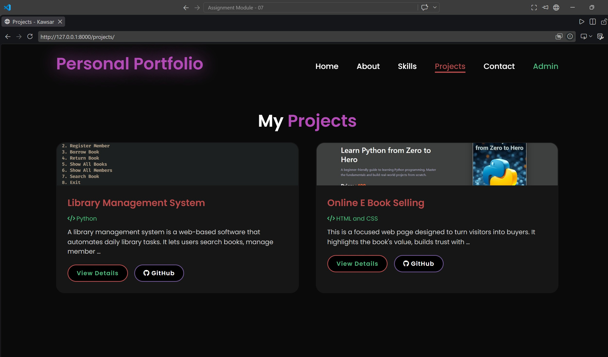
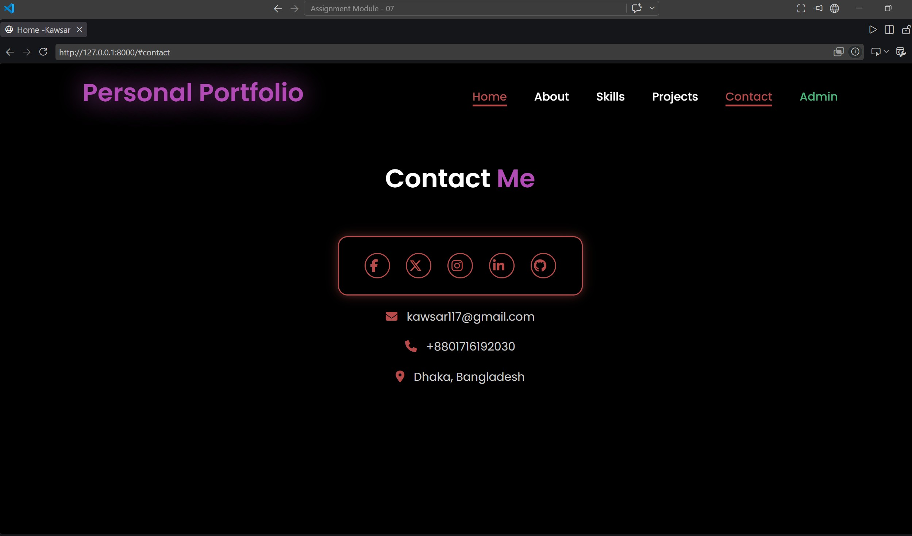
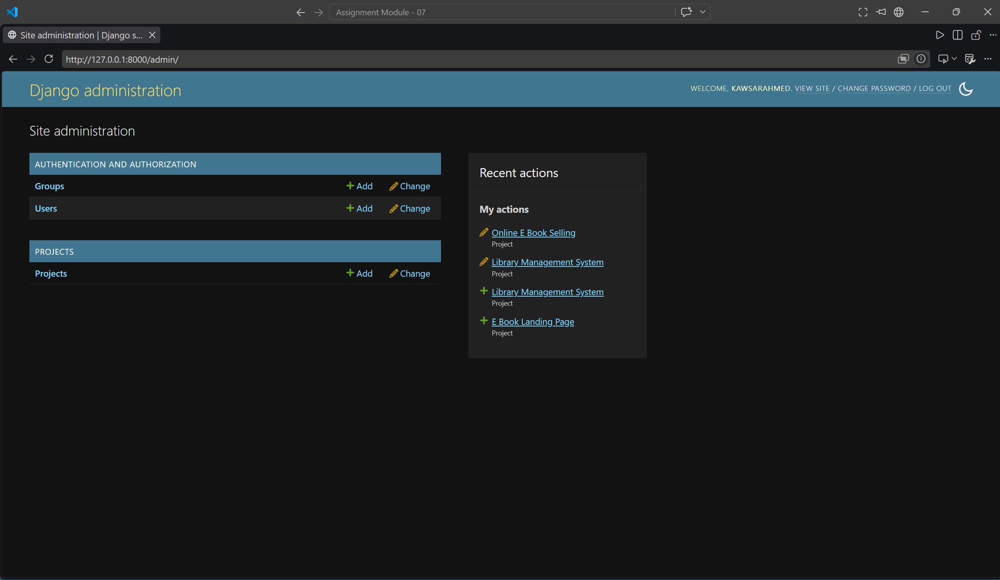
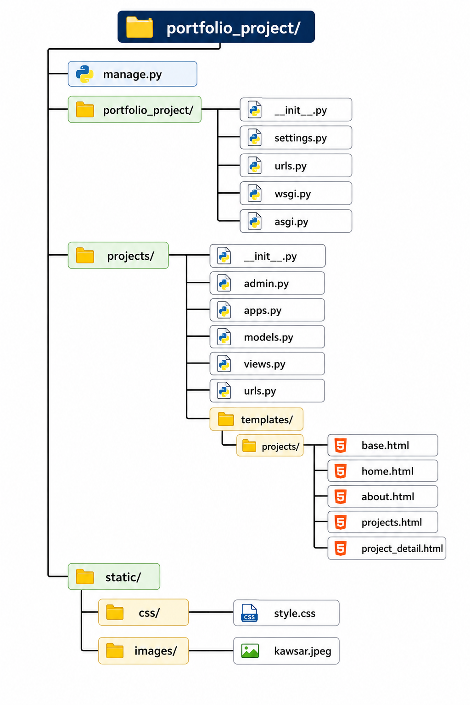

# Personal Portfolio Website

A clean, responsive personal portfolio built with Django to practice the core Django workflow: **Model → View → URL → Template**.

---

## Description

This is a full-stack personal portfolio website that showcases my profile, skills, and projects. It includes a custom admin panel to manage projects dynamically without touching the code. The design features a modern dark theme with smooth hover effects, animated typing text, and a fully responsive layout.

---

## Features

### Core Pages
- **Home Page** — Displays portfolio name, profile picture, short introduction, animated typing text, and social media links
- **About Page** — Detailed biography with profile image and call-to-action button
- **Projects Page** — Showing all projects with title, technology used, description, preview, and action buttons
- **Project Detail Page** — Individual project view with full description, technology used, GitHub link, and project image
- **Admin Panel** — Secure dashboard for full CRUD operations on projects

### Admin Capabilities
- Add new projects with title, description, technology, GitHub link, and image
- Edit existing project details
- Delete projects
- Search and filter projects by technology or date

### Design & UX
- Responsive navbar with active page highlighting
- Mobile-friendly menu
- Animated typing text effect on homepage
- Hover animations on project cards, buttons, and social icons
- Custom color-coded Admin button in navigation
- Footer on all pages

### Bonus Features
- About page with developer story
- Project image upload support via Django models
- GitHub button on every project card
- Contact section with email, phone, and location
- Skills section with technology icons

---

## Technologies Used

| Category | Technology |
|----------|------------|
| Backend | Python , Django |
| Database | SQLite (default) |
| Frontend | HTML5, CSS3 |

---

## Screenshots

--

Home Page

--

About Me

--

My Skills

--

My Projects

--

My Contact

--

Admin Panel

--

---

## Installation & Setup

### Prerequisites
- Python 3.10 or higher
- pip (Python package manager)
- Django 6.1 or higher

### Step 1: Clone or Create the Project
```bash
django-admin startproject portfolio_project
cd portfolio_project
python manage.py startapp projects
```

### Step 2: Install Dependencies
```bash
pip install django pillow
```

### Step 3: Configure Settings
Add the following to `portfolio_project/settings.py`:
```python
INSTALLED_APPS = [
    # default apps...
    'projects',
]

STATICFILES_DIRS = [BASE_DIR / 'static']

MEDIA_URL = '/media/'
MEDIA_ROOT = BASE_DIR / 'media'
```

### Step 4: Create Folder Structure
```bash
mkdir -p static/css static/images media/project_images
mkdir -p projects/templates/projects
```

### Step 5: Run Migrations
```bash
python manage.py makemigrations
python manage.py migrate
```

### Step 6: Create Superuser
```bash
python manage.py createsuperuser
# Enter username, email, and password when prompted
```

### Step 7: Add Your Profile Picture
Place your profile image at:
```
static/images/kawsar.jpeg
```

### Step 8: Start the Development Server
```bash
python manage.py runserver
```

### Step 9: Access the Application
| URL | Purpose |
|-----|---------|
| `http://127.0.0.1:8000/` | Home Page |
| `http://127.0.0.1:8000/about/` | About Page |
| `http://127.0.0.1:8000/projects/` | Projects Listing |
| `http://127.0.0.1:8000/admin/` | Admin Dashboard |

### Step 10: Add Projects via Admin
1. Navigate to `http://127.0.0.1:8000/admin/`
2. Log in with your superuser credentials
3. Click **Projects** → **Add Project**
4. Fill in the form and save
5. Visit `/projects/` to see your project live


---

## Project Structure



---
<!-- 
## Key Django Concepts Practiced

1. **Model** — `Project` model stores project data in the database
2. **View** — Python functions fetch and pass data to templates
3. **URL** — Routes map URLs to specific views (`/`, `/about/`, `/projects/`, `/projects/<int:pk>/`)
4. **Template** — HTML files extend `base.html` and render dynamic data
5. **Admin** — Django admin interface for content management
6. **Static Files** — Custom CSS for styling without JavaScript or Tailwind -->

<!-- ---

## Troubleshooting

| Issue | Solution |
|-------|----------|
| `TemplateDoesNotExist` | Ensure templates are inside `projects/templates/projects/`, not just `projects/templates/` |
| `no such table: projects_project` | Run `python manage.py makemigrations` then `python manage.py migrate` |
| `ModuleNotFoundError` | Install Pillow: `pip install pillow` |
| Static files not loading | Verify `STATICFILES_DIRS` includes your `static/` folder path |
| Admin button not visible | Ensure `` is used and URL names are correct |

--- -->

## License

This project is for educational purposes. Feel free to modify and use it for your own portfolio.

---

**Author:** Kawsar Ahmed Shajib